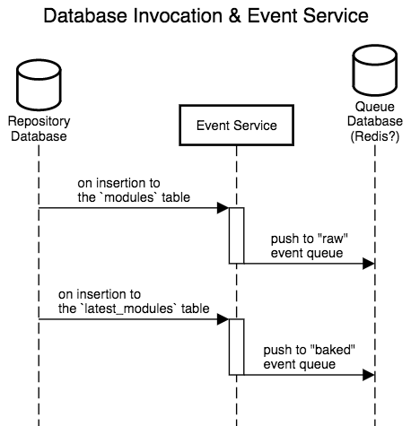
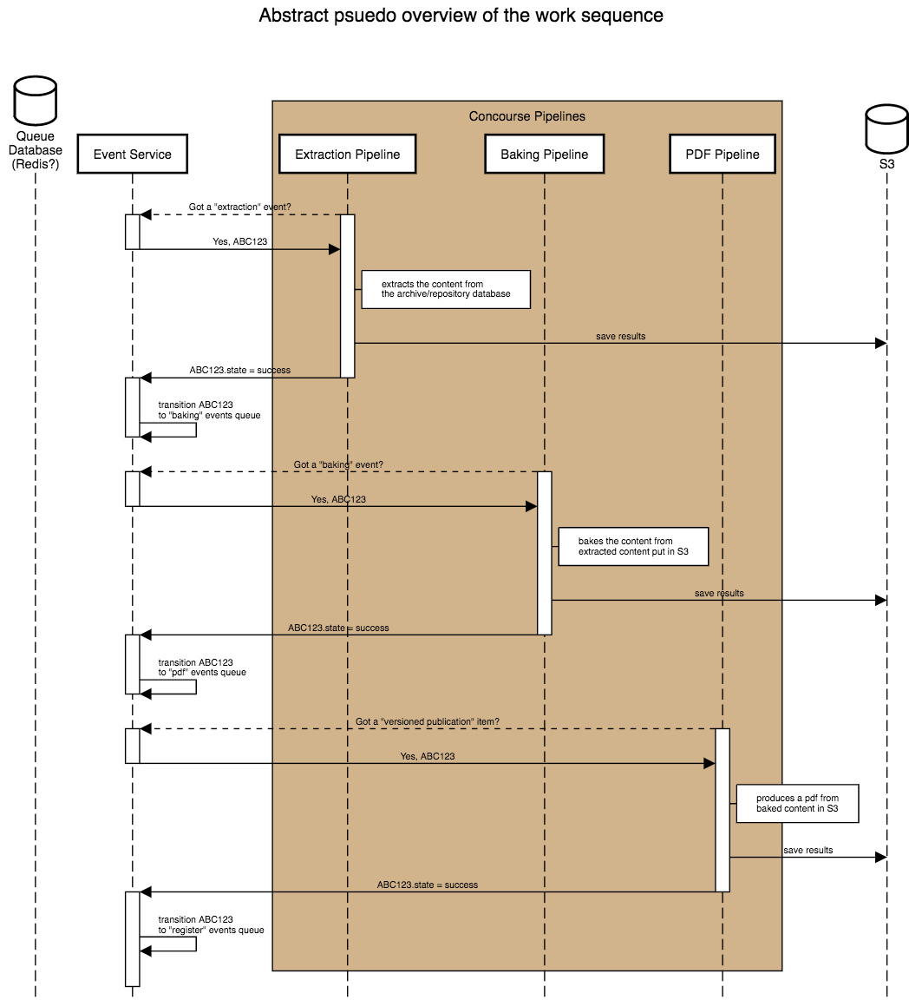

## Begin with the end in mind

> Begin with the End in Mind means to begin each day, task, or project with a clear vision of your desired direction and destination, and then continue by flexing your proactive muscles to make things happen. -- Covey'ism

This isn't set in stone! This is just the vision at the moment. It can be thrown away, amended, rewritten, phase shifted, or ignored. But please don't ignore it because that'll defeat the purpose of the exercise.

## A vision of our desired outcome

The system can be broken down into about three to four compoents. The other three major components are the [invocation](#invocation), [work](#work) and [persistence](#persistence). The fourth has is [error handling](#error-handling), which is interspersed in the invocation, work and persistence components. Combined these components make up the desired outputs for the "Baked Outputs" system.

The *Event Service* is not a component, but instead a hub element that is a fixed concept in this vision. The *Event Service* accepts events from an invoker, communicates the state of the event with the worker and successfully finalizes the state with the persister.

### Invocation

The invocation component is the part of the system that invokes the work by kicking it off. How this happens is up for debate and interpretation. For example, in the production scenario at this time we believe the database will be the invoker of work. However, it's just as easy to say that this component could be fulfilled with chatops (aka ce-bot in slack). The point is that this component is the catalyst for work to be pushed into action.

#### Database Invocation

This example of an invocation compoenent utilizes the database table insertions operations to create events in the Event Service.

[Edit URL](https://sequencediagram.org/index.html#initialData=C4S2BsFMAIBEENjwEbwM4wJIDsBuB7AY0RH22gDJoBRXSbYaAZUgCdcRDIAobgE0Qp0MAEQAlSAAd8aMPlYBPADrYESVBhHR00Psm6T4rUIRCGG0EbXqMW7TpC07IdBv0EbRARQCukPypqQhgqABQSfCBoAPwAlE5o0ACOfn68-MgAtAB8LjYAXGTQINgYxqTkwPgqwAAWMAAGALb4fD5QaA3Q6lDc8ISguIgweW6jwDkp-pD5kj5otd34lqzwAO4iKuPJqTx8kP2Dw9DjGTnjheQlZaBFVTX10A3gw2jAAPotbR1dPTyHICGwBGrmA3HGk12s3miyqllQAGtIHxNthtlM0vsAUCQTZeEA)

### Work

The work at this time is broken down into four separate work components that cascade their artifacts from one to the next. This cascading sequence is extraction -> baking -> pdf.

[Edit URL](https://sequencediagram.org/index.html#initialData=C4S2BsFMAIEECMDOwBOBDAxsaAHRBXSAEwHtoSA3SFCkSAd3IDNpgALGeklAa2kUgBHQgDsMkAFASiaYGnhoB0AEQBFQoQA6IgCKz5iyNoAUAJWIhEAfgCUy6IujDIhCTjQpQGEO5HZlAKJUftAAytS04vaOkMHAbh5ePmh+AOYoJPg40ADEciLQAMIkYpkoSgAKPpDgICKQiAmeIN6+-gEAHqiYoCXQVTg1dZDRiNCQXehYTUltKgBCaDx1qf3VtfWj0Ao8ku7NrSn+FToAYmuDGyMOYzhETBKQIkTS+gpKyqEAzFuIX1JSHLjSY9EAlR5xAA8AFpoRNulgAFyQxAgABekERAA4AHwAcRI2DQKnhU16InssSewCsElBFFkMFJPTpWBADOATLiEOp0JxzKRKPRmNxAE0GgAaODzQoARgATP8iJB6Yzxtz4CQOtAUCBUmxsCQWALgMjURjsfyQVgxuwYBgSpyQkwMgBbbR2hwoDBsdmQAD0KEgOBIqOA3AAntAZHJ3pITXy-mbhZbEGgqDqGvhwMBGgn+XFkxbcbAZQqvgA6ZBqgC8-HwGHEiEaytVnOBCPiba51J5fj5VL8RZFOO6IjDYIKpblio9ZGUOxWlLiY2crlbbI5Pb8gO2SxWfeAMOhO0xQuL+MJDhUi5EqWX1Np3b3u1ZoC36t7g+AfNPw8t4qIFK07ltIKqbmq34SJq2q6vqhosH+54jqetocNADp+NS0AuiQ7r1NanJEBhjrYTg+DYHUYT-KeiZfP+uJphmQYEDmjS0QW1IMTiIGKlWcjtnWBCNg0Lbge+aqnm+7KQdy34DoWyGWmOE59LxXxziodxMA+firhokgbhJ7ZQbu2mHse2ncQSRIqFQ5STsQuD4PAtQYLIk72GAkCuk+EHtuZz5QfJOJWUpYqStKM5KuJMkmRqWo6nqBrMLg9zcTgGREA2DTXtpOFutop7EZhTqUQU3xuPcdHcUxMAsdmuZVUwClceFPFlnx1aCfWInNmBz6Bf527xCF37cSpYCTlF5aacoQapJYnIoLpuZOAZAKbVt207bte1bUAA)

#### Extraction Work

#### Baking Work

#### PDF Work

### Persistence

In almost all cases we are saying S3 is the persistence medium. So while this is technically a component that could generally represent some type of storage, we've made a decision to throw all our work artifacts into S3.

### Error Handling

Error handling is interspersed in the invocation, work and persistence components. We're primarily dealing with recognizing an error and conveying that problem **state** to the *Event Service*.
